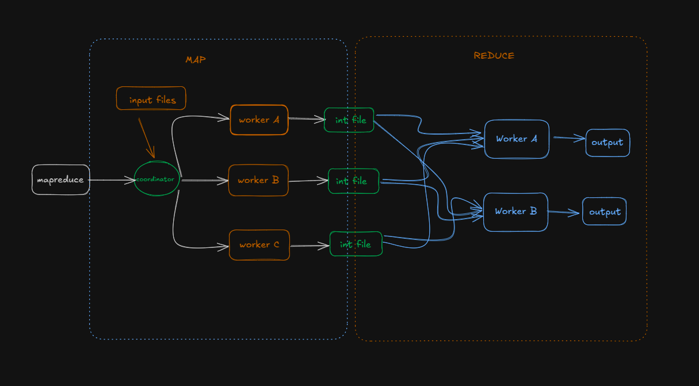

# Distributed Systems

## Concurrency 
- [Race Condition](/Concurrency/Goroutines/main.go)
- [Synchronization](/Concurrency/)
    - [WaitGroups](/Concurrency/WaitGroups/main.go)
    - [Mutex](/Concurrency/Mutex/main.go)
    - [RWMutex](/Concurrency/RWMutex/main.go)
    - [Cond](/Concurrency/Cond/main.go)
- [Deadlock, Livelock, Starvation](/Concurrency/)
    - [Deadlock](/Concurrency/Deadlock/main.go)
    - [Livelock](/Concurrency/Livelock/main.go)
- [Problems](/Concurrency/Problems/)
    - [Producer Consumer](/Concurrency/Problems/ProducerConsumer/main.go)
    
## MapReduce
Users specify a map function that processes a
key/value pair to generate a set of intermediate key/value
pairs, and a reduce function that merges all intermediate
values associated with the same intermediate key

[MapReduce Paper](https://static.googleusercontent.com/media/research.google.com/en//archive/mapreduce-osdi04.pdf)

Real-World Example: Counting Website Visits
Imagine counting daily visitors across thousands of websites:

MAP: Each worker counts visitors for a subset of websites

Worker A: "Google": 1,000,000, "Facebook": 800,000
Worker B: "Google": 900,000, "Twitter": 500,000
Worker C: "Facebook": 700,000, "Twitter": 400,000

SHUFFLE: The system organizes results by website name

"Google": [1,000,000, 900,000]
"Facebook": [800,000, 700,000]
"Twitter": [500,000, 400,000]

REDUCE: Workers sum up the values for each website

"Google": 1,900,000
"Facebook": 1,500,000